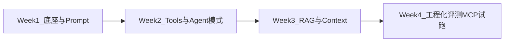

# 概览与一个月目标

面向已有多年 Java / Spring 后端经验、准备往 **AI Agent 工程**走的同学。一个月不是学完所有论文，而是交出一个别人愿意试跑的系统。

先看 [Agent 怎么学](./how-to-learn.mdx) 定方法，再按 [Week 1](./week-1.mdx)～[Week 4](./week-4.mdx) 执行；资料与官网集中在 [一手资料与官网](./resources.mdx)。

## 一个月交付物

用 **Java + Spring AI** 交付一个**准生产级单 Agent 服务**（责任链任务，不是泛聊天框）：

- 熟悉业务域的一条任务链（工单分流 / 内部知识问答 / 告警助手等择一）
- 3～5 个真实工具 + 结构化输出 + `maxSteps` / 超时 / 失败降级
- 轻量知识库检索工具（Agentic RAG 最小版）
- 执行轨迹、Token/成本日志、≥30 条 Golden Set、高风险动作人工确认
- 至少 3 人试跑 + Badcase 复盘说明
- **加分**：本地跑通一个 MCP Server；实现 Anthropic 中至少一种组合 workflow（如 routing 或 evaluator-optimizer）

:::info[时间假设]
每天约 **8 小时** × 约 28 天（约 220 小时）。某天只能学半天时，优先保住当日动手 DoD，砍「加分项 / 第二篇精读」。
:::

## 技术选型

| 层级 | 选择 | 说明 |
| --- | --- | --- |
| 主栈 | Java + Spring AI 2.x | 贴近存量 Spring Boot 系统；ChatClient、Tools、Advisors、VectorStore |
| 对照 | Python + LangChain / LangGraph | 只读概念、对照 harness，不以换栈为目标 |
| 协议 | MCP（第 4 周入门） | 统一工具发现与调用；本月只做最小实验 |
| 不选 | 微调 / 训练 / 多 Agent 平台 | 放第 2 个月 |

## 何时用 Workflow，何时用 Agent

口径对齐 [Anthropic: Building effective agents](https://www.anthropic.com/engineering/building-effective-agents)：

- **Workflow**：LLM 与工具按**预定义代码路径**编排（可预测、好测）。
- **Agent**：LLM **动态**决定下一步与工具用法（灵活、更贵、更易复合错误）。

优先找最简单能用的方案。任务路径固定时用 Workflow；步骤不可预知、需要模型决策时再上 Agent，并设好停止条件与人工确认。

## 每日节奏（约 8 小时）

| 时段 | 时长 | 内容 |
| --- | --- | --- |
| 上午 | 3h | 精读一手文档 + 笔记（概念、边界、反例） |
| 下午前段 | 3h | 动手：样例 → 自建业务 Agent |
| 下午后段 | 1.5h | 对照实验（换模型 / 改 Prompt / 手写 Loop vs 框架） |
| 收尾 | 0.5h | 日记：学会什么、卡点、明日首要任务 |

每周最后一天可做缓冲与复盘（仍算在 8h 内）。

## 四周总览

| 周 | 主题 | 出口 |
| --- | --- | --- |
| [Week 1](./week-1.mdx) | LLM 工程底座 + Prompt | 流式调用、结构化校验、项目选题一页纸 |
| [Week 2](./week-2.mdx) | Tool Calling + Agent 模式 | ≥3 工具单 Agent、轨迹可回放、≥2 种 workflow |
| [Week 3](./week-3.mdx) | RAG + Context | 小知识库、检索工具接入 Agent、拒答策略 |
| [Week 4](./week-4.mdx) | 评测、安全、MCP、试跑 | ≥30 Golden Set、多人试跑、Badcase 复盘 |

## 刻意不做（本月）

- 完整多 Agent 协作平台、MCP 企业权限审计全集
- 模型微调 / 训练、把技术栈整体换成 Python
- GraphRAG / 全公司知识库平台产品化

这些见 [resources 第 2 个月预览](./resources.mdx#第-2-个月预览)。
