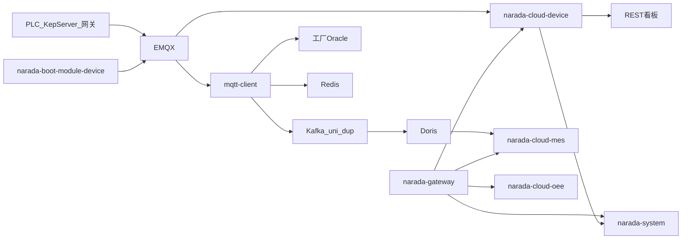

# 整体架构

云端基于 Narada Cloud 3.4.0（Spring Cloud Alibaba），入口是 Gateway；工厂侧有两类边端：TCP 连通性探测进程，以及真正吃测点流量的 `mqtt-client`。

## 模块地图

父工程 `narada-cloud-parent` 默认构建里 `narada-server-cloud` 常被注释，微服务仍按独立模块启动。

| 模块 | 应用名 / 端口 | 职责 |
| --- | --- | --- |
| `narada-cloud-gateway` | `narada-gateway` / 9998 | Spring Cloud Gateway + Nacos 发现 + Sentinel |
| `narada-cloud-nacos` | Nacos | 注册与配置（`narada.yaml`、`narada-device.yaml` 等） |
| `narada-cloud-device` | `narada-device` / 9002 | 台账、采集器、在线状态、看板、MQTT 状态订阅、保养点检维修 |
| `narada-cloud-mes` | `narada-mes-*` / 9203 | 制造执行；`@DS("doris")` 读测点；RestTemplate 调采集项限值 |
| `narada-cloud-oee` | `narada-oee` / 9600 | OEE 班次填报与报表（可用性 × 性能 × 质量），不是 MQTT 热路径 |
| `narada-cloud-wms` | `narada-wms` / 9500 | 仓储 |
| `narada-system-cloud-start` | `narada-system` / 7001 | 用户、字典、工作中心、公告 |
| `narada-visual/narada-cloud-xxljob` | XXL-JOB Admin | 调度控制台 |
| `narada-visual/narada-cloud-monitor` | 9111 | Spring Boot Admin |
| `narada-visual/narada-cloud-sentinel` | Sentinel | 流控面板 |
| `narada-boot-module-device` | `narada-device-data` / 9300 | 厂内 TCP/ICMP 探测，MQTT 上报联网状态 |
| `mqtt-client`（独立仓） | `/mqtt-client` / 9300 | 测点消费、双 Kafka、状态写 Oracle |

两个 9300 不要混：探测边端与 `mqtt-client` 都叫 9300，但是不同进程、不同工厂部署，靠 profile / Nacos 区分。

## 配置怎么进来

`narada-cloud-device` 本地 `application.yml` 很薄，真正的库、Redis、Rabbit、MQTT 多在 Nacos：`narada.yaml`、`narada-common.yaml`、`narada-device.yaml`。Gateway 路由走服务发现 locator。

`mqtt-client` 用 Spring profile 按厂切换：`test`、`prod-lp`、`prod-yz` 等，绑定 `narada.factory-code` 与独立的 Oracle / Kafka / MQTT broker。

## 跨服务通信

| 方式 | 用途 |
| --- | --- |
| Feign `ISysBaseAPI` → `narada-system` | 工作中心、字典、用户、站内信。看板先在请求线程解析中心 ID，再并行查库 |
| Feign `IDeviceBaseAPI` → `narada-device` | 按设备编码取台账、排除名单 |
| MES RestTemplate | `POST /deviceCollectItem/getItemLimits`（MES 关闭了 Feign） |
| MQTT / EMQX | 状态与测点的实时入口；`$queue/` 共享订阅做多实例分摊 |
| RabbitMQ | 云端台账变更 `device_info_{tenant}` → 边端刷新本地台账；可选 `device_online*` 回传 |
| Kafka | 仅测点/质检热路径；云端 Java **不**消费 `device_item_*`，由 Doris Routine Load 拉 |
| Redis | 边端设备名/工序/当前状态热点；云端 Token、序列号、Redisson |
| HTTP | 探测边端拉监控列表；云端用 EMQX 管理 API 查采集器在线 |

## 和 MES / OEE 的边界

- **MES**：过程数据、过站、PQC 质检。测点展示走 Doris `device_item_uni` / `device_item_dup`；限值走 device 的采集项配置。MES 有自己的一套 Kafka 业务 Topic（`pqc_check_*`、`history_pqc_check_*`、`fat_stack_item_*`、`app_log_dup` 等），过站数据走 DB 查询而非 Kafka；但 MES 的 `DeviceItemDupController.process()` 历史回填也会写 `device_item_uni/dup`，并非完全不碰测点通道。
- **OEE**：班次人工填报后算时间稼动、性能、合格率。不订阅 MQTT。
- **设备状态看板**：`narada-cloud-device` 的 REST，轮询 `device_online`，不是 WebSocket/SSE 推测点。

下一篇看两条数据面如何接入：[采集接入](./collection.mdx)。
