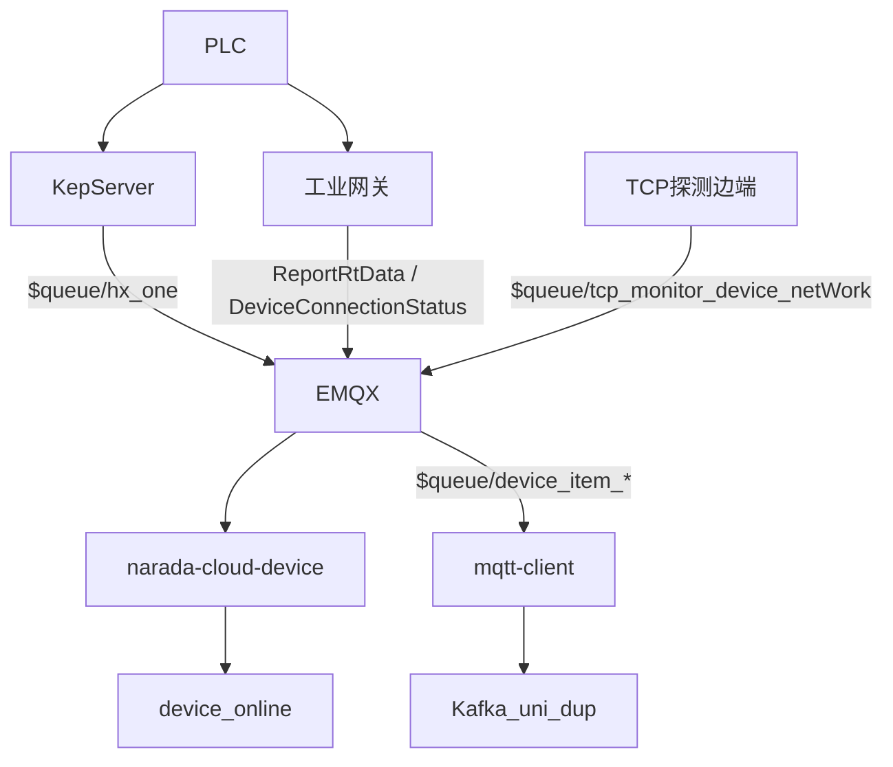

# 采集接入

接入分两层：**状态**（设备现在跑不跑、有没有故障、网通不通）和 **测点**（温度、压力、电流等过程值）。协议转换在现场（KepServer / 网关），平台只认 MQTT JSON。

## 状态三通道，一个写入模型

云端监听都在 `narada-cloud-device` 的 `org.jeecg.modules.device.listener`，QoS 均为 `AT_LEAST_ONCE`，Topic 带 `$queue/` 以便多实例分摊。

| 通道 | `GatherTypeEnum` | Topic / 入口 | 解析要点 |
| --- | --- | --- | --- |
| TCP 探测 | `0` TCP-探测 | `$queue/tcp_monitor_device_netWork` | JSON 反序列化为 `DeviceOnline` |
| KepServer | `1` KEPSERVER | `$queue/hx_one` | `values[]` 的 `id/v/q/t`；`q=false` 丢弃 |
| 工业网关 | `2` 网关 | `ReportRtData`、`DeviceConnectionStatus` 等 | `pld.array[].datas`；部分报文要 ACK 回写 |

KepServer 点位 `id` 按 `.` 拆：设备编码 + `_Error` / `fault` / `working`，分别落到联网、故障、运行。`_Error` 的布尔是反的：**true = 离线（status_value=1），false = 在线（0）**。

统一出口：`DeviceOnlineServiceImpl.addDeviceOnline(entity, gatherType)`。测点不走这条路径。

### 现场 TCP 探测边端

`narada-boot-module-device` 每分钟 Quartz（`0 0/1 * * * ?`）扫监控列表，`SocketUtil` 做 TCP/ICMP，再经 `MqttClientTemplate` 发到 `tcp_monitor_device_netWork`。云端还有遗留 Rabbit 消费者 `MonitorDeviceNetWorkReceiver`（队列 `direct_monitor_device_netWork`），主路径已切 MQTT。

设计意图：云服务不扫工厂内网，探测放在现场。

### 采集器在线（EMQX 客户端）

采集器实体 `DeviceDataCollector` 与设备通过 `COLLECTOR_DEVICE` 绑定。XXL-JOB `checkDeviceStatus`（`KeepJobHandler`）调 `EmqxUtil.getClientConnectStatus(collectorCode)`：采集器从 broker 掉线，则级联把绑定设备写成联网离线。

## 测点流：mqtt-client

主 Topic：`$queue/device_item_utf_8`，处理器 `DeviceItemListener`（不是云端 device 服务）。同仓还订了 GBK、网关、KepServer 测点变体，以及 FAT 堆栈 Topic。

云端 `MqttDeviceDataSubscribeListener` 里 `$queue/device_data` 的订阅是注释掉的，测点不以云端 MySQL 为热存储。

边端处理顺序：

1. MQTT 回调只 `queue.add`，不在 I/O 线程里打 Kafka
2. 单线程 `take` 后解析 JSON，Redis/Oracle 补设备名、工序、人员
3. 状态类测项（`run_status` / `fault_status` / `networking_status`）写工厂 `DEVICE_ONLINE`
4. 同一 JSON **双发** Kafka：`device_item_uni` 与 `device_item_dup`，key 为 `deviceCode`

编码有 UTF-8 / GBK 两套 Topic，兼容不同网关固件。

## 采集项配置不是时序库

表 `DEVICE_COLLECT_ITEM`（`DeviceCollectItem`）存的是 **点位元数据**：设备编码、采集点位、名称、数据类型、上传策略、上下限、租户。唯一约束是 `(deviceCode, collectPosition)` 与 `(deviceCode, itemName)`。

MES 通过 `getItemLimits` 拿上下限做过程校验；PQC 会拉浮点/整型测项名。实时值在 Doris，不在这张表。

Excel 导入导出走 EasyExcel，和台账、采集器绑定一起构成「能采什么」的配置面。

## 诚实边界

- OPC UA / Modbus / 自定义 Netty Server：**仓库里没有**，KepServer 与网关在上游完成。
- mica-mqtt 底层是 Netty，本仓是 **MQTT 客户端**，不是自研 Broker。
- 状态进关系库，测点进 Doris，看板实时态不读测点表。详见 [存储选型](./storage.mdx)。
