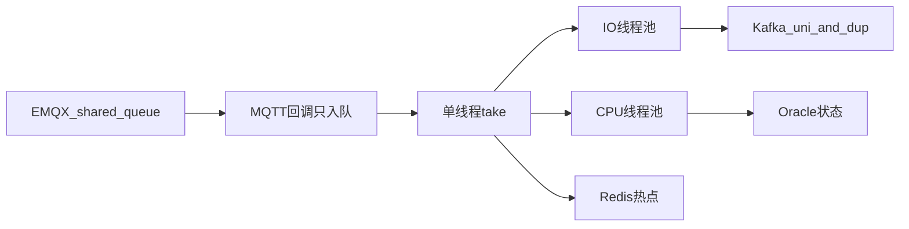

# 高并发设计

量级口径：2000+ 设备并发接入，测点日处理 1 亿+。热路径在 `mqtt-client`，云端 device 吃的是相对低频的状态变更。

## MQTT：QoS 1 + 共享订阅 + 断线换 clientId

订阅统一 `MqttQoS.AT_LEAST_ONCE`。Topic 前缀 `$queue/` 是 EMQX 共享订阅，同一组消费者分摊消息，边端和云端 device 都可以水平加实例。

断线处理在 `MqttClientConnectListener.onDisconnect`：重连时把 `clientId` 改成 `"mqttClient" + currentTimeMillis()`，并重填 username/password。注释写明场景是 **云平台 MQTT 用带时间戳的 clientId 做认证**（类似阿里云物联网）。`reconnect` + `re-interval` 在配置里打开（常见 5s）。

这对应常见描述里的「QoS 1 + 优雅重连 / 动态刷新 clientId」。

## 主路径：队列解耦，而不是在回调里打满下游

`DeviceItemListener` 订 `$queue/device_item_utf_8`：

1. 回调只把 payload 放进 `LinkedBlockingQueue`，立刻返回，避免堵住 mica-mqtt I/O 线程
2. 构造时提交单线程 `sendData()` 循环 `take()`
3. `processMessage` 里对一条 MQTT 里的多个测项 `CompletableFuture.runAsync(..., ioPool)`，状态更新走 CPU 池，`allOf().join()` 等本批完成
4. 失败最多再 `put` 回队列 3 次；中断时 sleep 100ms 防空转
5. 每 1000 条打一次日志，用 `remainingCapacity()` 而不是 `queue.size()`
6. `item_value` 截断到 1000 字符后再进 Kafka
7. `DisposableBean.destroy` 停循环，单线程池最多等 60s

这是 **当前生产主路径**。

## IO / CPU 隔离线程池

`ExecutorConfig`：

| Bean | 用途 | 规模 | 拒绝策略 |
| --- | --- | --- | --- |
| `asyncServiceExecutorIo` | Kafka / 拼 JSON / 远程 I/O | core 50，max 100 | `CallerRunsPolicy` |
| `asyncServiceExecutorIoCpu` | 设备状态落库 | core `N/2`，max `N/2+1` | `CallerRunsPolicy` |

`CallerRunsPolicy` 在池满时把任务打回调用线程，形成背压，而不是丢消息。Kafka 生产端另有 `linger.ms`（测试约 200ms，部分生产 2000ms）、`batch-size` 16KB、`acks=1`、`retries=10`。

## 双 Kafka：最新态 + 追加日志

`KafkaServiceImpl.sendData(topic, key, data)` 对同一 JSON 发两次，分区 key 一般是 `deviceCode`：

| Topic | Doris 模型 | 读法 |
| --- | --- | --- |
| `device_item_uni` | UNIQUE，保留最新 | MES 按设备 + 工厂取当前测点，例如 `order by collect_time desc limit 20` |
| `device_item_dup` | DUPLICATE，只追加 | 按 `op_time` 时间窗做过程追溯、聚合 |

云端 Java **没有** `@KafkaListener` 消费这两个 Topic。下游是 Doris Routine Load；MES `DeviceItemDupMapper.xml` 用 `@DS("doris")` 查。FAT、PQC 历史迁移也是 `*_uni` / `*_dup` 同一套路。

Redis 把设备名、工序名、人员、当前 `device:now:status::{device}:{statusType}` 做成 24h 热点，避免每条测点打 Oracle。台账变更通过 Rabbit `device_info_{factoryCode}` 失效/回填缓存。

## 自适应批次：设计在，主 Topic 不走它

`MqttDeviceDataSubscribeListener` 里有完整批次引擎：

- `MIN_BATCH_SIZE = 1`，`MAX_BATCH_SIZE = 100`
- 每 `ADJUSTMENT_INTERVAL = 5000` ms 看上一窗耗时：大于 1s 则批次 -10，否则 +10
- `ConcurrentLinkedQueue` 攒批，`processBatchAsync` 逐条 `sendData`

但 `$queue/device_item_utf_8` 在这个类上的 `@MqttClientSubscribe` **已注释**，定时 `processBatchIfNeeded` 也未启动。需要分清的是：这是按耗时在吞吐和延迟之间调批次的设计，**线上主流量改成了「无界队列 + 单消费线程 + 线程池扇出」**，避免回调线程和批次窗口互相卡住。

## 云端侧的并发点

状态写入 `addDeviceOnline` 用 `READ_COMMITTED`，只接受更新的 `gatherTime`，状态值不变则只延长历史段，减轻 PLC 高频心跳。连通性看板：请求线程先 Feign 解析工作中心（需要登录上下文），再 `CompletableFuture.supplyAsync` 并行查各分组联网/在线数。

XXL-JOB 把「在线历史 → 日时长/次数」和 Routine Load 巡检放到夜间/小时级，不跟热路径抢。

下一篇把「为何测点进 Doris 而不是 Influx/TDengine」展开：[存储选型](./storage.mdx)。
