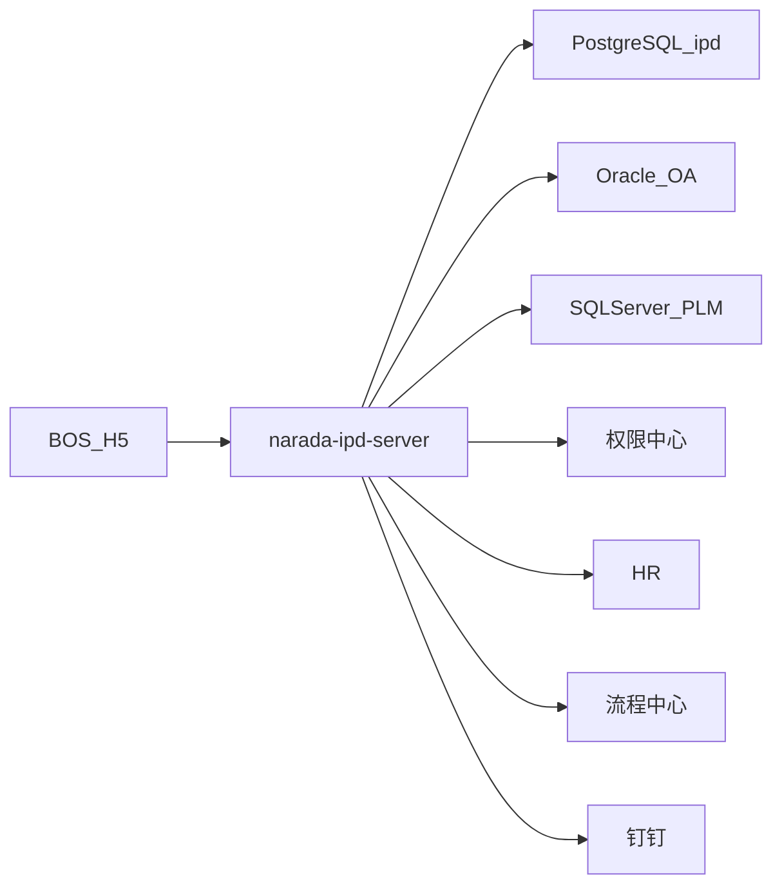

# 整体架构

入口 `IpdApplication`：`@EnableDiscoveryClient`、`@EnableFeignClients`、`@EnableRedisHttpSession`。端口 **8099**，配置从 Nacos `narada-ipd-server.yaml` 导入。Feign 底层开了 OkHttp。



和 [QMS](/docs/projects/qms/overview) 同属 Narada 业务模板族（Feign HR/权限、BPM 回调），但 IPD 已升到 Boot 3 / Java 21。和 [IME](/docs/projects/ime/overview) 不同：IME 是采集监控多服务，IPD 是研发运营单体。

## 包怎么切

```
com.nd
  controller/     Ipd*、Irp*、Plm*、grant、file
  service/impl/ipd
  bpm/            流程中心回调与 FlowCallbackFactory
  mk/             旧 OA HTTP 回调
  dingtalk/       机器人与 Stream
  feign/          权限中心、HR
  framework/      JWT、幂等、数据权限、LIKE 拦截
  job/            XXL-JOB
```

约 130 个 Controller。网关不在本仓，只消费 `X_GATEWAY_BASE_PATH` 一类头。

## 三数据源

`dynamic-datasource-spring-boot3-starter`，运行时 URL 在 Nacos：

| `@DS` | 典型用途 |
| --- | --- |
| `ipd` | 项目、任务、问题等主业务（PostgreSQL） |
| `master` | OA 评审主表，如 `KmReviewMainServiceImpl`（Oracle） |
| `plm` | PLM 零件，`PartServiceImpl`（SQL Server） |

这是 **按调用切库**，不是三库同事务分布式。不要写成 Seata 全局事务。

## 服务怎么对话

| 方式 | 对象 |
| --- | --- |
| OpenFeign 固定 url | `BasePermissionClient`、`BaseHrClient` |
| HTTP | `narada-flow-server`、钉钉服务、SAP 中间件、预算 |
| Redis | Session + 幂等键 |
| XXL-JOB | 任务超时、IRP、角色变更等定时 |

本仓没有 Gateway / Sentinel / Seata 模块。
