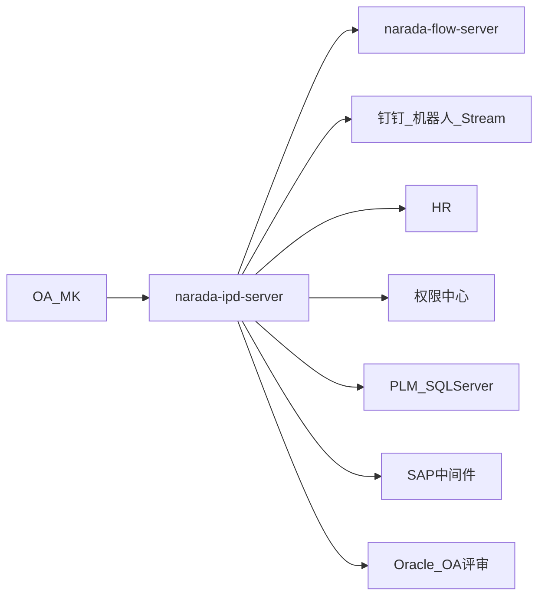

# 跨系统集成

IPD 自己不建流程引擎、通讯录或 PLM。对外是 HTTP / Feign / 切库。

## 流程中心与 OA

- **BPM**：回调进 `BpmController` → `FlowBackServiceImpl`（见 [审批流策略](./workflow.mdx)）
- **MK**：`MkController` 旧问题流 `IpdIssuesCallback`
- **OA 评审查询**：`KmReviewMainServiceImpl` `@DS("master")` 读 Oracle 评审主表，导出/列表，不是 IPD 自建评审引擎

## 钉钉

`dingtalk` 包：

- `RobotPrivateMessageService`：工作通知 / 机器人私聊
- `ChatBotCallbackListener`：Stream 回调，可做简单对话
- `IpdDingMsgServiceImpl`、XXL-JOB（任务、IRP、角色变更）定时催办
- `DingUtil` 调公司钉钉服务

审批节点变化、任务逾期、周报等会推到移动端。流量常常经 `narada-dingding-server`，不是每条都直打开放平台。

## HR 与权限中心

`BaseHrClient` 要人、组织；`BasePermissionClient` 要行/按钮/枚举。配置 `grant.baseUrl` / `grant.baseHrUrl` 在 Nacos。

## PLM 与 SAP

- PLM 零件：`PartServiceImpl` `@DS("plm")` SQL Server
- 物料主数据 / 部分同步：HTTP 调 SAP 中间件（与 QMS 类似的代理口径），在 `IpdDataMaterielServiceImpl`、`SAPHelper`

QMS 不在本仓 Feign 列表里；质量系统是并列产品，不要写成 IPD 内嵌 QMS。
