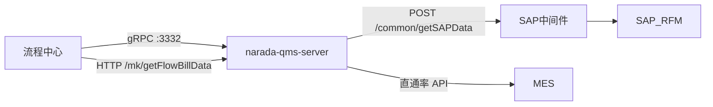

# 工作流与 SAP / MES

跨系统有三条主线：流程中心审批、SAP 主数据/金额、过程质量结果给 MES。

## gRPC 服务端：流程中心来拉、来写

`bootstrap.yml` 里 `grpc.server.port: 3332`。`RestApiServiceImpl`（`@GrpcService`）按 `funName` 分发到 `FlowExecService`：

| funName | 含义 |
| --- | --- |
| `getFlowData` | 取待审单据 |
| `getLastVersionData` | 上一版本 |
| `getFlowTitle` | 标题 |
| `updateByFlow` | 审批结果回写 |

这是模板里的「流程中心回调业务系统」标准口。工厂 `FlowBillDataFactory` 当前只挂了示例实现 `ExampleFlowBillImpl`，**不要把所有质量单据都说成已经走这套 gRPC 策略表**。

`GrpcClientPool`（commons-pool2）能按地址借 `RestApiClientSingle` 调别人的 gRPC。业务代码里 **没有注入调用**，视为脚手架，不是索赔闭环的主路径。

## 索赔审批：HTTP `/mk`

真实索赔走南都流程服务 HTTP：`MkController` `POST /mk/getFlowBillData`（`@PassToken`），`FlowBackService` 再进 `ClaimFlowCallback` / `Claim2FlowCallback`。财务确认、状态流转在这条链上，而不是客户端连接池打出去。

钉钉在过程问题跟踪里催办（`DingUtil`），和 OA 审批是两套通知。

## SAP：中间件 + RFM 名，不是 JCo

`SapUtil.querySapData` / `querySapDataPlus`：`HttpRequest.post(sapUrl + "/common/getSAPData")`，body 带 `functionName`、表名、字段列表，超时可到 30 分钟。本仓 **没有** sapjco / JCoDestination。

业务侧常见 RFM 名：

| 函数 | 用途 |
| --- | --- |
| `ZMM_GET_FACTORY1` | 工厂相关（索赔、`SapController`） |
| `ZEP_GET_VENDOR` / `ZEP_GET_VENDOR1` | 供应商 |
| `ZMM_GET_PURCHASEAMOUNT` | 采购金额（IQC 处罚/WPR） |

`SapServiceImpl` 还有物料主数据、生产订单等，同样 HTTP。准确说法是 **经 SAP 中间件调 RFM**；「SAP RFC 集成」若理解成进程内 JCo，和代码不符。

## MES

`getWeekDirectRateByProcedureId` 把过程直通率按工序给 MES。产品线主数据也能查 MES 侧产线。QMS 不订阅 IME 测点 MQTT。
