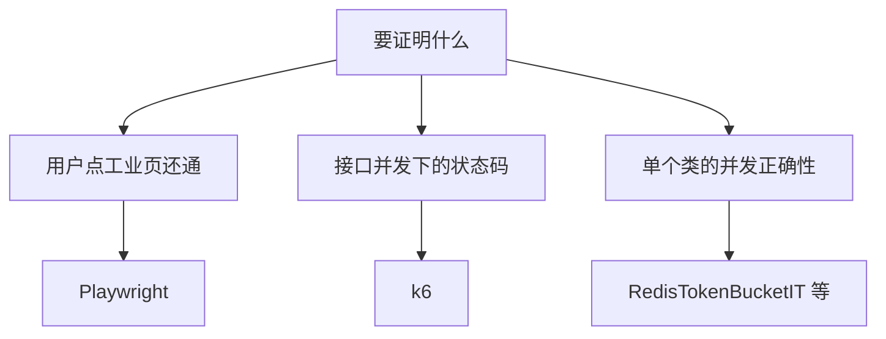

# Playwright 工业 E2E

[Playwright](https://playwright.dev/) 用真实浏览器跑端到端脚本：点登录、读侧栏、等 SSE 状态。和 [Grafana k6](/docs/tech-stack/loadtest/k6) 的分工是：Playwright 证明 **工业页还通、契约在浏览器里成立**；k6 证明 **并发下 HTTP 状态码还对**。两者都遵守同一条成本纪律——默认不打 Chat LLM / Embedding。

这是 ai-example **工业级第四阶段**，不是课程第四期 Hybrid RAG。入口是 [`frontend/e2e/industrial-default.spec.ts`](https://github.com/Feike1993/ai-example/blob/main/frontend/e2e/industrial-default.spec.ts)，CI 工作流 [industrial-e2e.yml](https://github.com/Feike1993/ai-example/blob/main/.github/workflows/industrial-e2e.yml)。

## 什么时候选 Playwright

先问「要证明什么」：

- **登录门、租户文案、安全面板、可观测快照**：DOM 和 sessionStorage，k6 够不着。
- **工具列表 / 探针按钮 / 坏文件 422**：浏览器 + `request` fixture 都能用，默认套件两者都写了。
- **不要用 Playwright 打穿令牌桶**：那是 k6 `rate_limit.js` 的工作。

## 默认套件证明什么

`industrial-default.spec.ts` **不**打开 Chat 流、**不**调 Embedding。它覆盖：

| 切片 | 断言 |
| --- | --- |
| 登录门 | 错密码停在登录；alice 登录后看到 `tenant-a` |
| 审计 | 安全面板能刷出本租户 `auth.login` |
| 快照 | 可观测面板有问答次数 / 空检索 / 护栏字段 |
| JWT 掉了 | 清掉 token 再刷新审计，回到登录门 |
| 工具策略 | alice 列表无 `rebuild_index`，探针「已拒绝」；admin 相反且探针不重建语料 |
| 媒体 | 无 JWT 探针 401 `auth_missing_token`；exe / 超限 422；小 jpeg/txt/pdf 返回摘要 |

这些路径之所以能进 CI，是因为后端提供了 **tool-probe、media/probe、lock-probe** 这类无模型接口。原理见 [生产 Agent 工具策略](/docs/ai-example/production/agent-tool-policy)、[媒体探针](/docs/ai-example/production/media-probe)。

## `@keys` 套件为何可选

[`industrial-keys.spec.ts`](https://github.com/Feike1993/ai-example/blob/main/frontend/e2e/industrial-keys.spec.ts) 打空检索拒答、admin 重建语料、bob 看不到 alice 的会话（跨租户 404）。空检索仍要 Embedding，完整生成还要 Chat Key，所以：

- 本机：有 `PROVIDER_DASHSCOPE_API_KEY`（或 `E2E_HAS_EMBEDDING=1`）才跑；
- CI：**默认工作流不跑** `@keys`，避免把密钥和账单绑进每个 PR。

语料已经入库时，向量路总会返回近邻，空检索用例会 skip——这是环境状态，不是断言写错。

## 和 k6、IT 怎么并列

| 层 | 工具 | 进 CI？ |
| --- | --- | --- |
| 类 / Redis 脚本 | `RedisTokenBucketIT`、`RedisSessionLockIT` | 按仓库测试任务 |
| 浏览器契约 | Playwright default | 是（`industrial-e2e.yml`） |
| 协议并发 | k6 smoke / guardrail / rate_limit | **否**（本机抖动大） |
| 真 LLM | `@keys`、工业页手点 | 本机选跑 |

k6 文里已经写过「Playwright 负责页面、k6 负责 `/api/v1`」。反向也成立：看见 429 / `Retry-After` 去 k6，看见登录门和侧栏去 Playwright。

## 刻意不做

- 默认套件不打 `/chat/stream`、`/agent/stream`、VL / ASR / TTS  
- 不把 k6 场景用 Playwright 再实现一遍  
- 不把教学 Playground E2E 和工业套件混成一个 spec

源码：[ai-example](https://github.com/Feike1993/ai-example) · `frontend/e2e`。
