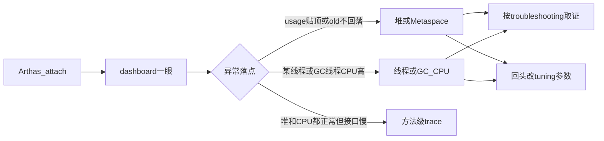

# Arthas 线上观察

改堆和 GC 看 [参数调优](./tuning.mdx)，症状分型与 `jcmd` / `jstack` 看 [故障排除](./troubleshooting.mdx)。这一页只讲：**先用 Arthas 看清现场，再决定要不要动参数**。

## 官网与作用

- 官网与文档：[https://arthas.aliyun.com/](https://arthas.aliyun.com/)
- 源码：[alibaba/arthas](https://github.com/alibaba/arthas)

Arthas 是阿里开源的 Java 诊断工具。它可以 **attach 到正在运行的 JVM**，在不改业务代码、不重启进程的前提下，观察线程、内存、GC、方法调用；定位以观察为主，不会主动挂起你的业务线程。

典型场景：CPU 持续偏高、堆或 Metaspace 持续上涨、接口偶发变慢、类冲突、临时确认某方法的入参与返回值。版本对照见 [Java 8 / 17 / 25 对照](./overview.mdx)。

## 快速上手

机器上已有 JDK（Arthas 4.x 支持 JDK 8+，含 17 / 21 / 25）时：

```bash
curl -O https://arthas.aliyun.com/arthas-boot.jar
java -jar arthas-boot.jar
```

按提示选择目标进程即可进入交互。容器里要能看到目标 PID，且一般与业务进程在同一容器（或具备 attach 所需权限）。安装细节、Web Console、Docker 见[官方文档](https://arthas.aliyun.com/doc/)。

:::tip
`dashboard` 默认约每 5 秒刷新；看完用 `Ctrl+C` 退出，避免长时间挂着刷新。
:::

## JVM 调优时先看哪些指标

调优前先用 `dashboard`（必要时配合 `memory`、`thread`、`jvm`）建立「堆是否紧、GC 是否忙、谁在烧 CPU」的画面。下面按面板分区说明 **字段含义** 和 **异常时暗示什么**；具体改 `-Xmx` / GC 开关仍回到 [参数调优](./tuning.mdx)。

### 堆与分区（Memory）

| 观察项 | 含义 | 异常时暗示 |
| --- | --- | --- |
| heap `used` / `total` / `max`、`usage` | 堆已用、当前提交容量、`-Xmx` 上限、使用率 | `usage` 长期贴 `max`：容量不够或泄漏；先取证再改堆 |
| eden / survivor / old（G1 则对应 eden、survivor、old） | 新生代与老年代占用 | old 锯齿向上抬、Full GC 后回不到基线：偏泄漏 |
| metaspace `used` / `max` | 类元数据区 | 持续上涨：类加载泄漏；加堆无效 |
| nonheap / code cache | 非堆与 JIT 代码缓存 | 辅助判断 native 是否吃内存，对上容器 limit |

`memory` 命令可单独拉一版内存明细，字段与 dashboard 的 Memory 区一致。

### GC（count / time）

dashboard 右侧常见 young / old（或 G1 young / old）的 **count** 与 **time**：

- **count**：采样窗口内（及累计）发生次数；young 频繁不一定坏事，old / Full 突然变密要警惕
- **time**：累计停顿或 GC 耗时；和接口超时时间戳对一下，才能判断「慢在不在 GC」

线程表里若 **GC 线程 `%CPU` 长期明显高于业务线程**，多半是堆紧或 Full GC 风暴：先对 [故障排除](./troubleshooting.mdx) 里的 GC 日志与 `jstat`，不要先瞎改 `InitiatingHeapOccupancyPercent` 一类细旋钮。

:::caution
Arthas 是实时旁证。Cause、Region、promotion 失败仍以 GC 日志为准；没有日志就改 IHOP，排障会更难。
:::

### 线程与 CPU

| 字段 | 含义 | 怎么用 |
| --- | --- | --- |
| `%CPU` | 采样间隔内该线程占用的 CPU 比例 | 找「谁在烧」；业务名还是 `GC Thread` / `C2 Compiler` |
| `DELTA_TIME` | 相对上次刷新的增量 CPU 时间 | 短时尖峰比累计 `TIME` 更敏感 |
| `STATE` | 线程状态 | 对照故障排除页的 BLOCKED / 连接池 WAITING |
| `NAME` | 线程名 | 能对上 Tomcat、Hikari、定时任务时，优先查池与超时 |

常用命令：

```bash
thread -n 5          # 最忙的若干线程及其栈
thread -b            # 找出当前阻塞其他线程的线程
```

堆和 GC 都正常、但某业务线程 `%CPU` 很高时，再考虑 `profiler` 或方法级观察，而不是先加 `-Xmx`。

### 运行时概览（Runtime / `jvm`）

| 观察项 | 含义 | 调优相关 |
| --- | --- | --- |
| `processors` | JVM 认为可用的处理器数 | 与容器 CPU limit 差很多时，考虑 `-XX:ActiveProcessorCount` |
| `systemload.average` | 系统负载均值 | 结合节点整体是否打满，避免只盯着单个 Pod |
| `uptime` | 进程已运行时间 | 区分「刚重启的尖峰」和「跑了几天的泄漏」 |

`jvm` 给出堆、GC、线程计数等总览，适合在 `dashboard` 之后补一眼「进程侧开关与计数」。

### 需要方法级时再加深

- `profiler`：生成火焰图，定位热点方法（算力侧）
- `watch` / `trace`：确认慢在本方法还是下游调用（调参前先分锅）

`jad` / `sc` / `redefine` 等热更新能力官网有完整说明，**本页不展开**；生产热替换要有变更窗口与回滚预案。

## 观察之后怎么决策



一句话：**Arthas 负责把现场摊开；GC 日志与 dump 负责定论；[参数调优](./tuning.mdx) 负责改少数旋钮。** 三者不要颠倒顺序。
