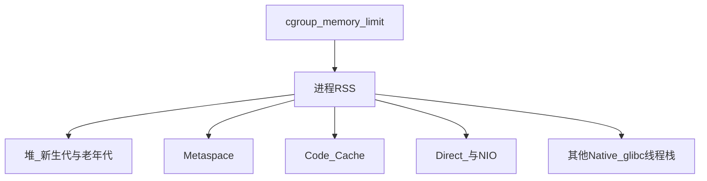

# Java 8 / 17 / 25 对照

现网不少 Spring Boot 服务仍停在 **Java 8**（例如 [QMS 概览](/docs/projects/qms/overview)、[IME 概览](/docs/projects/ime/overview)），而行业常见升级目标是 17 或更新的 LTS。Java 25 也是 LTS。三个版本的 **默认 GC、日志语法、容器感知、已删除标志** 差很多：把 8 的启动脚本原样贴到 17/25 上，轻则日志没了，重则 JVM 拒绝启动。

先对照默认行为，再看 [参数调优](./tuning.mdx) 和 [故障排除](./troubleshooting.mdx)。

中间的 **Java 21** 是常见踏板：虚拟线程、分代 ZGC 都在 21 进入生产路径。不必从 8 一次跳到 25。

## 运行时占用什么内存

进程 RSS 不是 `-Xmx`。容器 limit 要覆盖下面整块，只给堆留余量不够。



| 区域 | 是什么 | 调参时要注意 |
| --- | --- | --- |
| 堆 | 对象、数组 | `-Xms`/`-Xmx` 或 `MaxRAMPercentage` |
| Metaspace | 类元数据 | 动态加载、CGLIB 多时会涨；Java 8 已无 PermGen |
| Code Cache | JIT 编译代码 | 热路径多、方法多时可能撑满，表现为突然变慢 |
| Direct / NIO | Netty、NIO Buffer | 默认常跟堆上限挂钩；泄漏时堆直方图是干净的 |
| 线程栈 | 每个平台线程一块 | 线程爆炸会先打满 native，不一定先打满堆 |
| 其他 native | GC 内部结构、JNI、压缩库 | 堆设到接近 limit 时，这里是 **OOMKilled** 的常见原因 |

## 三个版本差在哪

| 维度 | Java 8 | Java 17 | Java 25 |
| --- | --- | --- | --- |
| LTS | 是 | 是 | 是 |
| 默认 GC（server 类机器） | Parallel GC | G1 | G1 |
| CMS | `-XX:+UseConcMarkSweepGC` 可用 | **已删除**，带该标志会启动失败 | 同 17 |
| G1 | 可开，非默认 | 默认 | 默认 |
| ZGC | 无 | 生产可用，**非分代** | 分代 ZGC（自 21 起，开 ZGC 即分代） |
| Shenandoah | 无（Oracle/部分发行版 8 也没有） | 生产可用 | 分代模式已是产品特性，**默认仍是单代** |
| Compact Object Headers | 无 | 无 | 产品特性，**默认关闭** |
| GC 日志 | `-XX:+PrintGC*`、`-Xloggc` | 统一日志 `-Xlog`；旧 PrintGC 无效或已删 | 同 17 |
| 容器 cgroup | **8u191+** 才较完整；更早的 8 可能按宿主机内存估堆 | 默认开启，认 memory/CPU limit | 同 17，认 cgroup v2 更稳 |
| 关键生产能力 | CMS、Parallel、基础 JFR（商业特性时期需注意发行版） | ZGC、JFR 开箱、统一日志 | Compact Headers、分代 Shenandoah、AOT cache、JFR 采样增强 |

Compact Object Headers（JEP 519）把 64 位上常见的对象头从约 96 bit 收到 64 bit，对象多时堆和 GC 压力都会降。Java 25 **要显式** `-XX:+UseCompactObjectHeaders`。把它设成默认是后续 JEP（如 [JEP 534](https://openjdk.org/jeps/534)）的事，不要写成「25 已经默认开」。

分代 Shenandoah（JEP 521）在 25 不再需要 `UnlockExperimentalVMOptions`，但 Shenandoah 默认仍是单代。要分代：

```bash
-XX:+UseShenandoahGC -XX:ShenandoahGCMode=generational
```

AOT cache（JEP 514/515）用训练运行缓存类加载与方法画像，缩短启动和预热，适合短生命周期或弹性扩缩的 Boot 实例。稳态 API 服务优先把堆和 GC 做对，再评估 AOT。

## 标志迁移

三版本都能用、建议默认带上（路径相对 **jar 启动目录**，先 `cd` 再启动）：

```bash
-XX:+HeapDumpOnOutOfMemoryError
-XX:HeapDumpPath=.
-XX:ErrorFile=./hs_err_pid%p.log
```

`HeapDumpPath=.` 指目录时，JVM 会写成 `java_pid<pid>.hprof`，避免固定文件名覆盖。不要写成 `heapdump.hprof`，也不要依赖 `HeapDumpPath` 里的 `%p`（8/17 上常不展开）。

GC 日志不要混用两套语法。

Java 8：

```bash
-XX:+PrintGCDetails
-XX:+PrintGCDateStamps
-Xloggc:./gc-%t.log
-XX:+UseGCLogFileRotation
-XX:NumberOfGCLogFiles=5
-XX:GCLogFileSize=20M
```

Java 17 / 25：

```bash
-Xlog:gc*:file=./gc-%t.log:time,uptime,level,tags:filecount=5,filesize=20M
```

从 8 升到 17 时，脚本里若还留着 CMS 或 `PrintGCDetails`，常见结果是：

- `-XX:+UseConcMarkSweepGC`：Unrecognized VM option，进程起不来
- `-XX:+PrintGCDetails`：被忽略或报错（视小版本而定），等于生产没有 GC 日志

`AggressiveOpts`、`UseCGroupMemoryLimitForHeap`（8 早期容器实验开关）、大量 CMS 细分项，升级时一律删掉，不要「先抄过来再看警告」。

## 升级时先清什么

**8 → 17**：删 CMS；GC 日志改成 `-Xlog`；确认基础镜像是 8u191 之后的容器行为，不要假设 17 和旧 8 估堆方式一样；用同一套压测看 G1 停顿是否可接受。

**17 → 25**：默认仍是 G1，多数 Boot 服务可以先升 JDK 再谈新 GC。分代 ZGC、Compact Object Headers、AOT 分开压测，不要一次全开。

下一步：[参数调优](./tuning.mdx) 给容器堆和三套保守启动行；出了问题走 [故障排除](./troubleshooting.mdx)。
