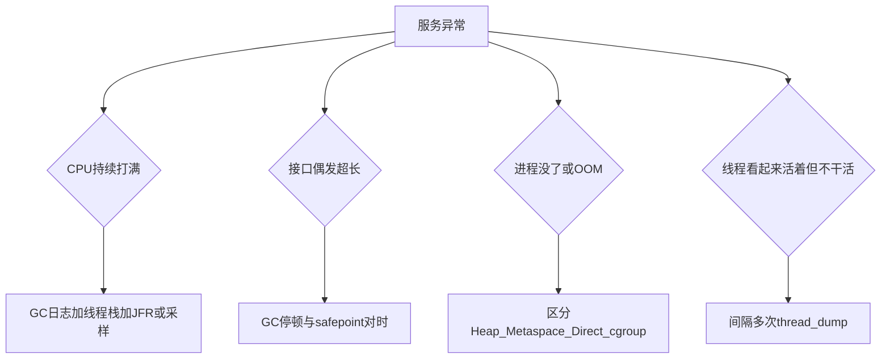

# 故障排除

调参模板见 [参数调优](./tuning.mdx)，版本差异见 [对照](./overview.mdx)。这一页按症状取证，不靠猜着加 `-Xmx`。

## 先分型



同一时刻尽量拿到：**GC 日志、间隔 10～20 秒的多次 thread dump、容器 limit/RSS、是否有 heap dump**。缺一样，后面很容易调错方向。

## OOM 不是同一种病

| 现象 | 多半是 | 下一步 |
| --- | --- | --- |
| 日志有 `Java heap space` | 堆不够或泄漏 | dump + 直方图；先看缓存、Byte[]、会话 |
| `Metaspace` / `Compressed class space` | 类加载泄漏 | 查动态代理、热部署、反复 `ClassLoader` |
| `Direct buffer memory` | NIO/Netty Direct | `MaxDirectMemorySize` 与是否未 `release` |
| `unable to create native thread` | 平台线程打满或 `nproc` | dump 看线程名；连接池、Feign、无界 `new Thread` |
| `OutOfMemoryError: GC overhead limit exceeded` | 堆几乎满，GC 空转（8 上更常见） | 当堆问题处理，不要先关 `UseGCOverheadLimit` |
| Pod `OOMKilled`，**没有** Java OOM 日志 | cgroup 杀进程：堆 + native 超过 limit | 降 `-Xmx` / `MaxRAMPercentage`，或加 limit；查 Direct 和线程数 |

heap dump 要在 JVM 自己抛 OOM 时才靠谱（已开 `HeapDumpOnOutOfMemoryError`）。被内核杀掉时往往 **没有** hprof，这时看 kubelet 事件、`dmesg`、容器 last state。

## 工具按版本

PID 用 `jcmd -l` 或容器里的 `ps`。三版本都能用：

```bash
jcmd <pid> VM.flags
jcmd <pid> Thread.print
jstat -gcutil <pid> 1000 20
```

`GC.heap_info` 是 **Java 9+** 才有，不要在 8 上套。

### Java 8

```bash
jmap -histo:live <pid> | head
jstack <pid>
```

GC 看 jar 启动目录下的 `gc-*.log`（配置见 [参数调优](./tuning.mdx)）。`jmap -dump:format=b,file=./heap.hprof <pid>` 会 STW，生产只在窗口内、或对副本做。

### Java 17

优先 `jcmd`，少用旧 `jmap` 语法。

```bash
jcmd <pid> GC.heap_info
jcmd <pid> GC.class_histogram
jcmd <pid> JFR.start name=app settings=profile duration=60s filename=/tmp/app.jfr
```

GC 看 `-Xlog:gc*` 那份文件。

### Java 25

17 的命令都能用。线程还可落到文件（21 起）：

```bash
jcmd <pid> Thread.dump_to_file /tmp/threads.txt
```

GC 必须有 `-Xlog:gc*`，否则排停顿只能靠猜。Java 25 的 JFR 在 CPU-time、协作采样、方法计时上更细（部分仍是实验项），**稳态 API 先 60 秒 profile 录音**，够用再开更重的事件。

`jhsdb jmap` / MAT 分析 hprof 的步骤与版本无关：先 Dominator Tree 和 leak suspect，不要一上来翻几千万对象。

## CPU 高

先看 GC 是否在忙：`jstat -gcutil` 里 `FGC`/`YGC` 频率、GC 日志里单次暂停和吞吐。GC 占满 CPU 时加应用线程数没有用。

GC 不忙再看应用：thread dump 里大量 `RUNNABLE` 且栈在同一业务方法，或 JFR/采样顶在 JSON、加解密、正则。Java 8 没有好用的开箱 JFR 时，多次 `jstack` 也能看出热点栈。

## 停顿长、接口偶发超长

把慢请求时间戳对上 GC 日志：

- G1/Parallel：**Evacuation Failure / Full GC**、老年代占用长期 > 80%、`Metadata GC Threshold`
- 有 `System.gc()`（RMI、NIO、某些连接池）：先查谁调的，再考虑 `-XX:+DisableExplicitGC`（明白副作用再开）
- 大对象、一次性加载整个 Excel：先改应用分批，不要只加大堆
- safepoint 很久：日志里看 Time to safepoint；偏向锁在 15+ 已默认关，25 上更不必再翻旧的 BiasedLocking 帖子

Java 8 的 CMS 并发失败会落入 Full GC，停顿可能秒级，这是升级 G1/ZGC 的理由，不是再叠 CMS 参数的理由。

## 无响应与线程

间隔多次 dump，对比是否同一批线程卡在同一把锁或同一个池。

| dump 里常见状态 | 含义 |
| --- | --- |
| `BLOCKED` | 等 monitor；看锁持有者在干什么（经常是慢 SQL、同步日志） |
| `WAITING` / `TIMED_WAITING` 在 `HikariPool` / 连接池 | 连接耗尽或下游慢，不是堆小 |
| `WAITING` 在 `LinkedBlockingQueue.take` | 队列消费者在等任务，要看上游是否堵住 |
| 死锁段落 | `jcmd Thread.print` 会直接打出来；先解死锁再谈 GC |

线程名能对上 Tomcat、Hikari、XXL、Feign 时，优先调池大小和超时。无界线程或每个请求 `new Thread` 会走向 native thread OOM。

**Java 21/25 虚拟线程：** dump 里可能是海量虚拟线程 + 少量 carrier。不要用 Java 8「几千平台线程 = 有问题」的经验硬套。看 pinning、同步块里是否包了阻塞 JDBC、以及是否把虚拟线程和固定大小的连接池配歪。

## Full GC 之后加堆还是查泄漏

| 信号 | 更像 |
| --- | --- |
| 流量高峰才 Full GC，低峰恢复 | 容量不足，可加堆或降流量 |
| 老年代占用锯齿向上，Full GC 后仍回不到基线 | 泄漏；dump 对比两个时间点 |
| 导入/报表期间一次 Full GC | 大对象或一次性 List；改分批 |
| 重启后几天必挂 | 泄漏或 Metaspace；不要无限加 `-Xmx` |

## 取证清单

窗口内尽量凑齐：

- [ ] 发生时间、副本、JDK 版本（`java -version`）
- [ ] 容器 memory/cpu limit 与 request、当时 RSS
- [ ] GC 日志（jar 启动目录下的 `gc-*.log`）
- [ ] thread dump **至少 3 次**，间隔 10～20 秒
- [ ] 若是 JVM OOM：同目录下 `java_pid*.hprof` 是否写出、盘是否够
- [ ] 若是 OOMKilled：事件原因 `cgroup` / `LimitExceeded`，不要当 Java heap 处理
- [ ] 变更：刚调的 `JAVA_OPTS`、刚加的缓存、刚放大的导入

有这些再回头改 [参数调优](./tuning.mdx) 里的堆或 GC。没有日志就改 IHOP，多半会把下一次排障变得更难。
