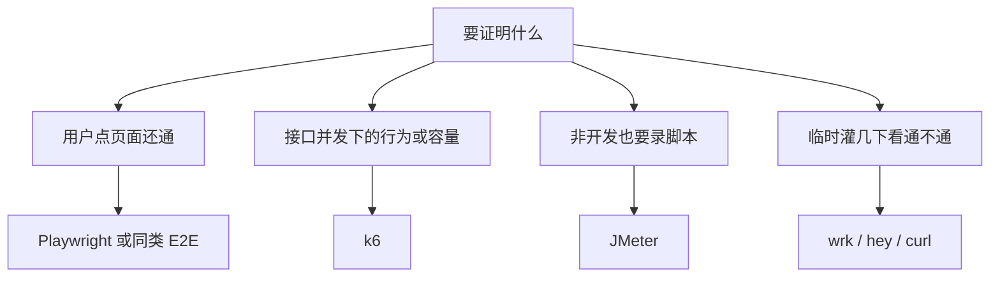
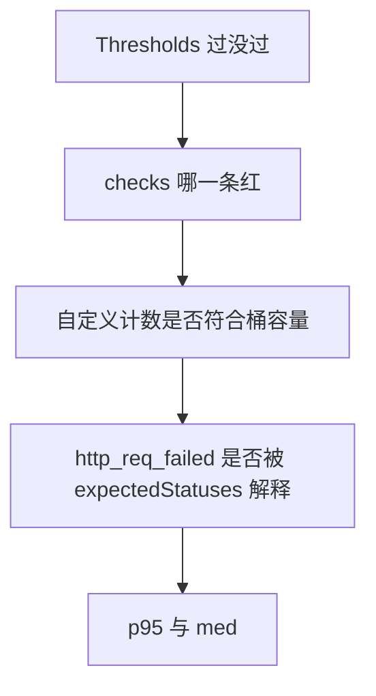

# Grafana k6

[Grafana k6](https://grafana.com/docs/k6/latest/) 是用 JavaScript 写场景、用 Go 跑引擎的**协议级负载测试**工具。脚本进 Git，结果用阈值判定通过或失败。官网文档：[k6 docs](https://grafana.com/docs/k6/latest/)；源码：[grafana/k6](https://github.com/grafana/k6)。

它测的是 HTTP / WebSocket / gRPC 这类接口行为，不是浏览器里点按钮。和 [ai-example](https://github.com/Feike1993/ai-example) 的分工是：Playwright 负责工业级页面 E2E，k6 负责打 Java 的 `/api/v1`。

## 什么时候选 k6

先问「要证明什么」，再选工具。k6 适合下面几类问题：

- **接口在并发下还对不对**：限流是否真的 429、护栏是否仍 422、错误码和 `Retry-After` 是否还在。
- **廉价路径的本机容量基线**：不打 LLM，只打 `/me`、审计、运维快照这类读接口，记下 p95 和到达率。
- **场景即代码**：VU、迭代次数、阈值都写在脚本里，Code Review 能看懂，本地和 CI 用同一份（ai-example 选择**不进 CI**，因为本机抖动大）。
- **失败要可判定**：不只是「打了一会儿」，而是 `threshold` 不满足就非零退出。



| 需求 | 更合适 | 原因 |
| --- | --- | --- |
| 浏览器点击、会话、前端路由 | Playwright | k6 默认不渲染 DOM；浏览器模块是另一条线 |
| HTTP API 场景、阈值、Git 协作 | **k6** | JS 场景 + 内置摘要 + `checks` / `thresholds` |
| 测试同学强依赖 GUI、一堆协议插件 | JMeter | 上手偏图形，脚本和 CI 更重 |
| Python 团队、要在脚本里直接调业务库 | Locust | 和 k6 定位接近，生态不同 |
| 随手看一下 QPS | wrk / hey | 没有场景、断言、阈值 |

**不必上 k6 的时候**：正确性已由集成测试覆盖（例如 `RedisTokenBucketIT`）、只关心一次请求的功能、或目标是「模型生成有多快」。后一种又贵又吵，ai-example 的默认套件**故意不打 Chat LLM / Embedding**。

## 先记住四个词

读摘要之前，这四个词要对上脚本，否则数字会对不上意图。

| 词 | 含义 | 在 ai-example 里 |
| --- | --- | --- |
| **VU** | 虚拟用户，并发执行 `default` 函数的工人 | smoke 默认 8 个；限流脚本 1 个（避免自己打乱桶） |
| **iteration** | `default` 跑完一轮 | `login_limit` 固定 15 轮，因为登录桶默认 10 / 60s |
| **check** | 单次断言，失败默认**不**让测试红 | 「状态码是 200 或 429」「body.code 是 `rate_limited`」 |
| **threshold** | 整场测试的门禁，不满足则失败 | `prod_login_limited count>=1`：这场必须至少看到一次限流 |

另外两个容易踩坑的开关：

- **`http.expectedStatuses(...)`**：告诉 k6 这些状态码是预期，不计入 `http_req_failed`。422 / 429 / 403 若不声明，失败率会虚高，门槛 `http_req_failed rate<0.01` 会误红。
- **`setup()`**：全场只跑一次。登录放这里，VU 复用 JWT，避免把登录 IP 桶打光——限流脚本自己还要用这个桶。

## ai-example 怎么跑

对应仓库 [loadtest/](https://github.com/Feike1993/ai-example/tree/main/loadtest)，打的是本机 Java **`http://127.0.0.1:8080/ai-example/api/v1`**，不经过 Vite，也不走 Compose 前端的 8088。限流原理见 [Redis 令牌桶](/docs/ai-example/principles/production/redis-token-bucket)。

### 前置

1. PostgreSQL + Redis 已起。
2. 已设 `PRODUCTION_KEK`。
3. Java 在 8080：`cd java && ./gradlew bootRun`。
4. 本机有 `k6`（`brew install k6`）或 Docker Desktop。`run.sh` 优先本机 CLI，否则 `docker run grafana/k6:1.0.0`。

Mac 上容器访问宿主机用 `host.docker.internal`。摘要里若出现 `script: /scripts/login_limit.js`，说明走的是 Docker 挂载，不是本机路径。

### 一条命令

```bash
./loadtest/run.sh smoke        # 廉价读 + alice ingest 403
./loadtest/run.sh guardrail    # POST /chat 违禁词 → 422
./loadtest/run.sh rate_limit   # 打穿 chat 桶 → 429
./loadtest/run.sh login_limit  # 打穿登录 IP 桶 → 429
./loadtest/run.sh all
```

覆盖地址：

```bash
BASE_URL=http://127.0.0.1:8080/ai-example ./loadtest/run.sh smoke
```

四个脚本各自证明一件事，不要混成「随便打打看 QPS」：

| 脚本 | 打什么 | 期望 | 默认负载 | 门槛 |
| --- | --- | --- | --- | --- |
| `smoke.js` | `GET /me` `/audit` `/ops/snapshot`；alice `POST /rag/ingest` | 200 / **403** `ingest_forbidden` | 8 VU × 30s | 失败率 `< 1%`，p95 `< 1s`，checks `> 99%` |
| `guardrail.js` | `POST /chat` 含 `违禁演示词` | **422** `input_deny` | 1 VU × 5 次 | checks 全过 |
| `rate_limit.js` | 同上护栏题连打 | 出现 **429** + `Retry-After` | 1 VU × 40 次 | 自定义计数 ≥ 1 |
| `login_limit.js` | `POST /auth/token` 同 IP 连打 | 出现 **429** | 1 VU × 15 次 | 自定义计数 ≥ 1 |

`GET /me` 等**不走** chat 令牌桶，所以 smoke 才能当容量基线。chat / agent 默认 **30 / 60s**（租户+主体），登录默认 **10 / 60s**（IP）。护栏在会话锁之前返回，默认套件也就**不测** `session_busy` 409——那必须走过检索/生成。

### 脚本在干什么：以登录限流为例

```javascript
export const options = {
  vus: 1,
  iterations: 15,
  thresholds: {
    prod_login_limited: ['count>=1'],
  },
}

export default function () {
  http.setResponseCallback(http.expectedStatuses(200, 429))
  const res = httpPostJson('/api/v1/auth/token', { username, password })
  check(res, { '200 或 429': () => res.status === 200 || res.status === 429 })
  if (res.status === 429) {
    loginLimited.add(1)
    check(res, {
      'rate_limited': (r) => errorCode(r) === 'rate_limited',
      'Retry-After': (r) => Boolean(header(r, 'Retry-After')),
    })
  }
}
```

读法：

1. **1 个 VU、15 次**：容量是 10，迭代必须多于 10，否则可能一次 429 都看不到，门槛永远过不了。
2. **200 和 429 都算成功 HTTP**：要验证的是「桶会拒绝」，不是「登录永远 200」。
3. **自定义 Counter `prod_login_limited`**：只有 429 才加一。门槛卡的是这个计数，不是延迟。
4. **429 时再 check 业务字段**：`code === rate_limited`，并且带 `Retry-After`。只看状态码不够，网关随手回 429 也会让计数过门。

chat 侧的 `rate_limit.js` 同一套路：先 `setup()` 登录一次，再连打护栏题（仍 422，不碰 LLM），迭代 ≥ 40，计数 `prod_rate_limited`。

## 结果怎么看

k6 结束时在终端打一份摘要。**从上往下看：先门槛，再检查，再自定义计数，最后才是延迟和吞吐。** 倒过来容易把一次「限流验证成功」读成「接口好慢」或「失败率很高」。

下面这张是 `./loadtest/run.sh all` 里 `login_limit` 的摘要。前一行 `40/40 shared iters` 是刚跑完的 `rate_limit`。


按区块对照：

### 1. 场景头：这场实际跑了什么

| 摘要里的字 | 含义 |
| --- | --- |
| `execution: local` | 引擎在本机（或本机 Docker）跑，不是 Grafana Cloud |
| `script: /scripts/login_limit.js` | Docker 把 `loadtest/k6` 挂到 `/scripts` |
| `1 max VUs`、`15 iterations shared among 1 VUs` | 单工人串行 15 轮，没有把登录桶用并发打乱 |

`all` 会按 smoke → guardrail → rate_limit → login_limit **顺序连跑**。登录桶按 IP，前面三个脚本的 `setup()` 已经消耗过令牌，所以 `login_limit` 里的 429 会比「空桶满容再打 15 次」更多。要和默认 10 容量对账，请单独跑 `./loadtest/run.sh login_limit`。

### 2. THRESHOLDS：这轮有没有及格

截图：

```text
prod_login_limited
✓ 'count>=1' count=7
```

门槛通过，且自定义计数是 7：15 次登录里有 7 次被限流。这是本场**主结论**。若这里是叉，后面延迟再漂亮也算失败——桶没拦住。

### 3. checks：业务断言有没有全过

截图：`checks_succeeded 100%`，`29 out of 29`。

29 从哪来：

- 15 次都有 `'200 或 429'` → 15
- 7 次 429 额外检查 `'rate_limited'` 和 `'Retry-After'` → 14
- 15 + 14 = **29**

所以绿的不只是「HTTP 没挂」，而是：拒绝时错误码对、`Retry-After` 在。某一项 check 变红时，先对脚本里的名字，再对响应体，不要先去调 VU。

### 4. CUSTOM：限流发生了多少次

`prod_login_limited 7` 与门槛里的 `count=7` 是同一个 Counter。它**不是** QPS 指标；`12.2/s` 只是计数速率，对这种 15 次短脚本没有容量含义。

单独跑且桶是满的：大约 10 次 200、5 次 429。截图 7 次 429，和「`all` 已经用过同一 IP 桶」一致，不是容量配置错了。

### 5. HTTP：延迟和失败率

| 指标 | 截图里的数 | 怎么读 |
| --- | --- | --- |
| `http_reqs` | 15，约 26/s | 总请求数；短脚本的每秒速率受本机和迭代间隔影响，不要当 SLA |
| `http_req_failed` | **0 / 15** | 因为声明了 200 与 429 都是预期。若没声明，7 个 429 会变成失败率约 47%，看起来像事故 |
| `http_req_duration` | avg 37.87ms，med 68.88ms，p95 69.87ms，min 1.4ms | 看 **p95 / med**，不要只看 avg。min 被极快请求拉下去，avg 会低于中位数 |

摘要里带 `expected_response:true` 的那一行，是「被当成成功响应」的子集。这里和总体重合，因为失败率是 0。

登录限流这场**不是**在测性能。p95 ~70ms 只能说明本机 Java 回 200/429 很快；不能外推 Chat / RAG。要本机容量基线，去看 **smoke** 的 `http_reqs` 和 `http_req_duration` p95。

### 6. EXECUTION / NETWORK：辅助，不是结论

- `iterations: 15`：和脚本声明一致，没有提前被门槛打断。
- `iteration_duration` 略高于 `http_req_duration`：一轮里还有 JS 断言等开销。
- `data_received` / `data_sent`：体积很小，符合 token JSON，不是大包或 SSE 流。

## 平时盯哪些指标

按「这场要证明什么」选一组，不要每次把摘要从头背到尾。

### 门禁（先看）

| 指标 | 何时盯 | 红了说明什么 |
| --- | --- | --- |
| 自定义 Counter 的 `count>=1` | 限流 / 护栏「必须出现某种业务结果」 | 保护没触发，或打的路径根本不走桶 |
| `checks` `rate==1` 或 `rate>0.99` | 状态码和错误码必须稳定 | 断言失败；先看是哪一条 check 的名字 |
| `http_req_failed` `rate<0.01` | smoke 这类「预期几乎全是成功 HTTP」 | 真故障或忘了把 403/422/429 设为 expected |

### 延迟（容量基线时看）

| 指标 | 含义 | 用法 |
| --- | --- | --- |
| `http_req_duration` **p95 / p90 / med** | 端到端耗时（发送 + 等待 + 接收） | smoke 门槛是 p95 `< 1s`；对比时用同一分位，不要用 avg |
| `http_req_waiting` | 等到首字节（TTFB） | 变大通常是服务端或下游，不是本机上传 |
| `http_req_connecting` / `tls_handshaking` | 建连与握手 | 短连接、首次打 HTTPS 时会抬高；热身后应下来 |
| `iteration_duration` | 一整轮脚本 | 明显长于 `http_req_duration` 时，看看是不是 `sleep` 或一轮里打了多次 HTTP（smoke 一轮四次请求） |

k6 的 `http_req_duration` **不含**排队等连接、TCP、TLS。本机 `http://127.0.0.1` 上这几段通常可以忽略；打到远端或 HTTPS 时要把它们补进阅读顺序。

### 吞吐与并发（解读边界）

| 指标 | 含义 | 注意 |
| --- | --- | --- |
| `http_reqs` | 总请求数与到达率 | 受 VU、`sleep`、服务端限流共同限制 |
| `vus` / `vus_max` | 当前 / 峰值虚拟用户 | 限流脚本固定 1 VU 是故意的 |
| `iterations` | 完成的轮数 | `shared iterations` 是全场分完就停，不是每个 VU 都跑满 N 次 |

ai-example 默认 **30 次/分钟** 是 chat 教学限流，不是「这台机器能打多少次 LLM」。提高 smoke 到达率应改 `vus` / `duration`；若要暂时放开 chat 桶，改 `PRODUCTION_RATE_CAPACITY` 后**重启 Java**，且这不影响 smoke。

### 建议的阅读顺序



1. 门槛红：先当功能回归，再谈性能。
2. checks 红：对脚本里的名字和响应 `code` / 头。
3. 自定义计数和配置容量对账，并确认有没有刚跑过 `all`。
4. `http_req_failed` 异常时，先查是不是少声明了预期状态码。
5. 最后才读 p95，而且只对 smoke 这类容量脚本有意义。

## 如何留下一次本机基线

只对 **smoke** 有意义，数字只对你这台机器成立，不要写成云上 SLA。

1. Java / Redis / Postgres 已热身。
2. `./loadtest/run.sh smoke`，记下 `http_reqs`、`http_req_duration` p95。
3. 需要更高到达率时改 `smoke.js` 的 `vus` / `duration`。
4. 需要的话把输出存下来（`loadtest/results/` 已 gitignore）：

```bash
k6 run --out json=loadtest/results/smoke-$(date +%Y%m%d).json loadtest/k6/smoke.js
```

Grafana Cloud k6、Web Dashboard（`K6_WEB_DASHBOARD=true`）适合看趋势和分布；本仓库默认只读终端摘要，足够判断门槛和限流计数。

## 刻意不做

- 不把 k6 默认套件打进 CI（本机抖动；Lua 正确性看 `RedisTokenBucketIT`）
- 不打 Chat LLM / Embedding，不用 k6 估模型吞吐
- 不测 `session_busy` 409（要占会话锁必须走过生成）
- 不用 k6 替代 Playwright 页面 E2E
- 不把 `all` 里 `login_limit` 的 429 次数直接当成「登录容量配置值」
